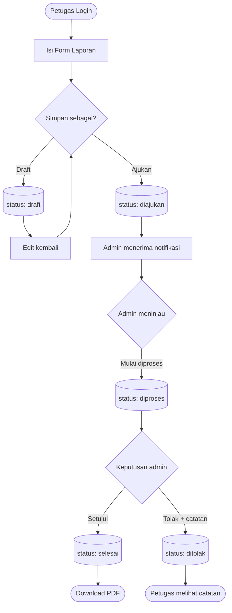
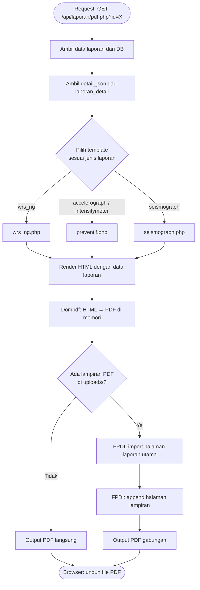

# Bab 5 — Alur Bisnis

---

## 5.1 Alur Pembuatan & Persetujuan Laporan

### Status Laporan

| Status | Keterangan |
|--------|-----------|
| `draft` | Laporan belum diajukan, hanya bisa dilihat oleh pembuat |
| `diajukan` | Laporan sudah dikirim ke admin untuk ditinjau |
| `diproses` | Admin sedang meninjau laporan |
| `selesai` | Laporan disetujui dan selesai |
| `ditolak` | Laporan ditolak oleh admin; dapat dilihat catatan penolakan |

### Diagram Alur



### Aturan Transisi Status

- **Petugas** hanya dapat mengubah laporan saat masih `draft` (via `update.php`)
- **Admin** mengubah status via `update_status.php`; nilai yang diizinkan: `diajukan`, `diproses`, `selesai`, `ditolak`
- Admin **tidak dapat** melihat atau mengedit `draft` milik petugas lain
- Laporan yang sudah berstatus `diajukan` ke atas **tidak bisa diedit** oleh petugas

---

## 5.2 Alur Generate PDF

Laporan dicetak dalam format PDF menggunakan Dompdf. Jika laporan menyertakan lampiran berformat PDF, file-file tersebut digabung menggunakan FPDI.

### Diagram Alur



### Detail Teknis

- **Library:** Dompdf `^2.0` untuk render HTML → PDF; FPDI `2.6` + FPDF `1.8` untuk merge
- **Template:** File PHP di `api/laporan/pdf_templates/` yang menghasilkan string HTML
- **Kop instansi:** Logo dimuat dari `assets/kop/` dan disematkan sebagai base64 atau path absolute
- **Label dinamis:** Template `preventif.php` membaca `tipe_laporan` dari `detail_json` untuk menentukan label checklist (`Accelerograph` / `Intensitymeter`)

---

## 5.3 Alur Upload Foto & Galeri

Foto dokumentasi diunggah bersamaan dengan pengiriman form laporan (create atau update).

### Diagram Alur Upload

```mermaid
flowchart TD
    A([Form submit dengan foto[]]) --> B[API: create.php / update.php]
    B --> C{Validasi file:\nekstensi & ukuran ≤ 5MB}
    C -->|Gagal| D([Respons 422: file tidak valid])
    C -->|Lolos| E[Buat folder uploads/{laporan_id}/]
    E --> F[Simpan file dengan nama unik]
    F --> G[INSERT ke tabel dokumentasi_foto\nfile_name, caption, laporan_id]
    G --> H([Respons sukses])
```

### Diagram Alur Hapus Foto (saat edit)

```mermaid
flowchart TD
    A([Form update dengan delete_foto_ids[]]) --> B[API: update.php]
    B --> C[Ambil record foto dari DB]
    C --> D[Hapus file fisik dari uploads/]
    D --> E[DELETE FROM dokumentasi_foto WHERE id IN ...]
    E --> F([Foto terhapus dari DB & disk])
```

### Galeri

- Endpoint `GET /api/laporan/gallery.php` mengumpulkan semua foto dari tabel `dokumentasi_foto`
- Setiap item di respons menyertakan field `url` (full URL ke file) yang dibangun dari `BASE_URL + /uploads/ + file_name`
- Petugas hanya melihat foto dari laporannya sendiri; admin melihat semua

### Struktur Penyimpanan

```
uploads/
  {laporan_id}/
    {timestamp}_{nama_file_original}.jpg
    {timestamp}_{nama_file_original}.jpg
    ...
```
