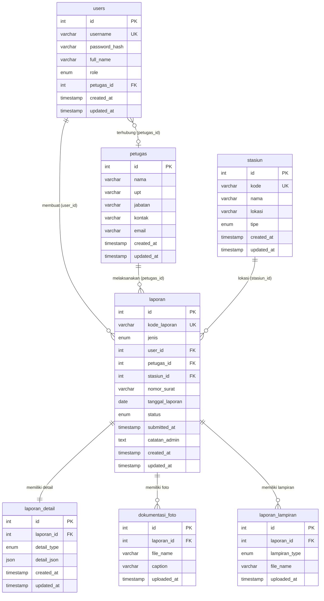

# Skema Database — SIMPels BMKG

**Versi Dokumen:** 1.0  
**Tanggal:** 2026-03-03  
**Database:** `laporan_bmkg` (MySQL 8.x, charset `utf8mb4_unicode_ci`)

---

## 1. Diagram Relasi (ERD)



---

## 2. Definisi Tabel

### 2.1 `users`
Menyimpan akun pengguna yang dapat login ke SIMPels.

| Kolom           | Tipe                          | Null | Default   | Keterangan                              |
|-----------------|-------------------------------|------|-----------|-----------------------------------------|
| `id`            | INT AUTO_INCREMENT            | NO   | —         | Primary key                             |
| `username`      | VARCHAR(50) UNIQUE            | NO   | —         | Username login, harus unik              |
| `password_hash` | VARCHAR(255)                  | NO   | —         | Hash bcrypt dari password               |
| `full_name`     | VARCHAR(100)                  | NO   | —         | Nama lengkap pengguna                   |
| `role`          | ENUM(`admin`, `petugas`)      | NO   | `petugas` | Peran pengguna dalam sistem             |
| `petugas_id`    | INT (FK → petugas.id)         | YES  | NULL      | Keterkaitan dengan data petugas         |
| `created_at`    | TIMESTAMP                     | NO   | NOW()     | Waktu akun dibuat                       |
| `updated_at`    | TIMESTAMP                     | NO   | NOW()     | Waktu akun terakhir diubah              |

**Constraint:**
- `fk_users_petugas`: `petugas_id` → `petugas(id)` ON DELETE SET NULL ON UPDATE CASCADE

---

### 2.2 `petugas`
Data master teknisi / petugas lapangan BMKG.

| Kolom        | Tipe          | Null | Keterangan                               |
|--------------|---------------|------|------------------------------------------|
| `id`         | INT AI PK     | NO   | Primary key                              |
| `nama`       | VARCHAR(100)  | NO   | Nama lengkap petugas                     |
| `nip`        | VARCHAR(30)   | YES  | NIP pegawai                              |
| `upt`        | VARCHAR(150)  | NO   | Unit Pelaksana Teknis asal petugas       |
| `jabatan`    | VARCHAR(100)  | YES  | Jabatan / posisi                         |
| `kontak`     | VARCHAR(50)   | YES  | Nomor telepon / HP                       |
| `email`      | VARCHAR(100)  | YES  | Alamat email                             |
| `created_at` | TIMESTAMP     | NO   | Waktu data dibuat                        |
| `updated_at` | TIMESTAMP     | NO   | Waktu data terakhir diubah               |

---

### 2.3 `stasiun`
Data master stasiun / site peralatan seismik.

| Kolom        | Tipe                                                                   | Null | Keterangan                          |
|--------------|------------------------------------------------------------------------|------|-------------------------------------|
| `id`         | INT AI PK                                                              | NO   | Primary key                         |
| `kode`       | VARCHAR(20) UNIQUE                                                     | NO   | Kode unik site, contoh: `BDG-001`   |
| `nama`       | VARCHAR(150)                                                           | NO   | Nama stasiun                        |
| `lokasi`     | VARCHAR(255)                                                           | NO   | Deskripsi lokasi geografis          |
| `tipe`       | ENUM(`WRS`, `Accelerograph`, `Intensitymeter`, `Seismograph`, `Lainnya`) | NO | Jenis peralatan di stasiun          |
| `created_at` | TIMESTAMP                                                              | NO   | —                                   |
| `updated_at` | TIMESTAMP                                                              | NO   | —                                   |

---

### 2.4 `laporan`
Tabel utama yang mencatat setiap laporan pemeliharaan.

| Kolom              | Tipe                                                          | Null | Default  | Keterangan                                   |
|--------------------|---------------------------------------------------------------|------|----------|----------------------------------------------|
| `id`               | INT AI PK                                                     | NO   | —        | Primary key                                  |
| `kode_laporan`     | VARCHAR(30) UNIQUE                                            | NO   | —        | Kode unik laporan, contoh: `ACC-20260303-001`|
| `jenis`            | ENUM(`wrs_ng`, `accelerograph`, `seismograph`)                | NO   | —        | Jenis peralatan yang dipelihara              |
| `user_id`          | INT (FK → users.id)                                           | NO   | —        | Petugas yang membuat laporan                 |
| `petugas_id`       | INT (FK → petugas.id)                                         | YES  | NULL     | Petugas pelaksana (dari master petugas)      |
| `stasiun_id`       | INT (FK → stasiun.id)                                         | YES  | NULL     | Stasiun lokasi pemeliharaan                  |
| `nomor_surat`      | VARCHAR(100)                                                  | YES  | NULL     | Nomor surat tugas (WRS NG)                   |
| `tanggal_laporan`  | DATE                                                          | NO   | —        | Tanggal pelaksanaan kegiatan                 |
| `status`           | ENUM(`draft`,`diajukan`,`diproses`,`selesai`,`ditolak`)       | NO   | `draft`  | Status persetujuan laporan                   |
| `submitted_at`     | TIMESTAMP                                                     | YES  | NULL     | Waktu laporan diajukan ke admin              |
| `catatan_admin`    | TEXT                                                          | YES  | NULL     | Catatan penolakan / persetujuan dari admin   |
| `created_at`       | TIMESTAMP                                                     | NO   | NOW()    | —                                            |
| `updated_at`       | TIMESTAMP                                                     | NO   | NOW()    | —                                            |

**Constraint:**
- `fk_laporan_user`: `user_id` → `users(id)` ON DELETE CASCADE
- `fk_laporan_petugas`: `petugas_id` → `petugas(id)` ON DELETE SET NULL
- `fk_laporan_stasiun`: `stasiun_id` → `stasiun(id)` ON DELETE SET NULL

**Index:**
- `idx_laporan_jenis` pada kolom `jenis`
- `idx_laporan_status` pada kolom `status`

---

### 2.5 `laporan_detail`
Menyimpan seluruh data teknis laporan dalam format JSON. Satu laporan memiliki tepat **satu** baris detail.

| Kolom         | Tipe                                           | Null | Keterangan                                        |
|---------------|------------------------------------------------|------|---------------------------------------------------|
| `id`          | INT AI PK                                      | NO   | Primary key                                       |
| `laporan_id`  | INT (FK → laporan.id)                          | NO   | Referensi ke laporan induk                        |
| `detail_type` | ENUM(`wrs_ng`, `accelerograph`, `seismograph`) | NO   | Harus identik dengan `laporan.jenis`              |
| `detail_json` | JSON                                           | NO   | Data teknis lengkap (lihat skema JSON di bawah)   |
| `created_at`  | TIMESTAMP                                      | NO   | —                                                 |
| `updated_at`  | TIMESTAMP                                      | NO   | —                                                 |

**Constraint:**
- `fk_detail_laporan`: `laporan_id` → `laporan(id)` ON DELETE CASCADE

**Index:**
- `idx_detail_type` pada kolom `detail_type`

---

### 2.6 `dokumentasi_foto`
Menyimpan referensi file foto dokumentasi lapangan per laporan.

| Kolom         | Tipe          | Null | Keterangan                                             |
|---------------|---------------|------|--------------------------------------------------------|
| `id`          | INT AI PK     | NO   | Primary key                                            |
| `laporan_id`  | INT FK        | NO   | Referensi ke laporan                                   |
| `file_name`   | VARCHAR(255)  | NO   | Path relatif file, contoh: `1/foto_sensor_sebelum.jpg` |
| `caption`     | VARCHAR(255)  | YES  | Caption foto, digunakan untuk mapping ke PDF           |
| `uploaded_at` | TIMESTAMP     | NO   | Waktu upload                                           |

> **Penting:** Nilai `caption` digunakan sebagai kunci untuk mencocokkan foto dengan baris checklist di template PDF. Format caption: `{label item} - sebelum` atau `{label item} - sesudah`.

---

### 2.7 `laporan_lampiran`
Menyimpan referensi file PDF lampiran (Surat Tugas & Checklist fisik).

| Kolom           | Tipe                               | Null | Keterangan                         |
|-----------------|------------------------------------|------|------------------------------------|
| `id`            | INT AI PK                          | NO   | Primary key                        |
| `laporan_id`    | INT FK                             | NO   | Referensi ke laporan               |
| `lampiran_type` | ENUM(`surat_tugas`, `checklist`)   | NO   | Jenis lampiran                     |
| `file_name`     | VARCHAR(255)                       | NO   | Path relatif file PDF              |
| `uploaded_at`   | TIMESTAMP                          | NO   | Waktu upload                       |

**Constraint:**
- `UNIQUE KEY uniq_lampiran (laporan_id, lampiran_type)` — setiap laporan hanya boleh punya satu surat tugas dan satu checklist

---

## 3. Skema `detail_json` per Jenis Laporan

Kolom `detail_json` di tabel `laporan_detail` bersifat schema-flexible. Berikut struktur lengkap per jenis laporan.

### 3.1 Accelerograph / Intensitymeter (`detail_type = 'accelerograph'`)

```json
{
  "tipe_laporan": "accelerograph | intensitymeter",
  "nomor_spt": "...",
  "kode_site": "BDG-001",
  "nama_site": "Stasiun Bandung",
  "deskripsi_kerusakan": "...",
  "rekomendasi": "...",
  "status_alat": "Baik | Rusak | Perlu Perbaikan",

  "petugas_pelaksana": [
    { "nama": "Budi Santoso", "nip": "198001012005011001" }
  ],

  "kondisi_peralatan": [
    {
      "category": "WRSNG",
      "label": "Sensor",
      "kondisi_sebelum": "Baik",
      "kondisi_sesudah": "Baik"
    }
  ],

  "pembersihan": {
    "lingkungan": "Dilakukan | Tidak",
    "peralatan": "Dilakukan | Tidak"
  },

  "pencatatan_parameter": {
    "sisa_token": 120,
    "tegangan_sumber": 220,
    "tegangan_output_stabilizer": 220,
    "tegangan_output_ups": 220,
    "tegangan_baterai": 12.5,
    "jumlah_baterai": 2
  },

  "pengecekan_listrik": {
    "ketahanan_ups": "60 menit"
  },

  "pengecekan_komunikasi": {
    "ping_modem": "OK",
    "ping_digitizer": "OK",
    "ping_display": "OK",
    "ping_server": "OK"
  },

  "pengecekan_peralatan_seismik": {
    "leveling_sensor": "OK",
    "slmon_simora": "Online"
  },

  "catatan_penggantian": [
    {
      "nama_alat": "Baterai",
      "merk_type": "Yuasa 12V",
      "jumlah": "2",
      "sn_baru": "YS2024001",
      "sn_lama": "YS2020001",
      "keterangan": "Drop tegangan"
    }
  ]
}
```

**Kategori `kondisi_peralatan`** yang digunakan (sesuai `checklistMaster`):

| Nilai `category` | Ditampilkan sebagai (PDF)         |
|------------------|-----------------------------------|
| `WRSNG`          | Accelerograph / Intensitymeter    |
| `Sistem Kelistrikan` | Sistem Kelistrikan            |
| `Sistem Komunikasi`  | Sistem Komunikasi             |
| `Peralatan Seismik`  | Peralatan Seismik             |

---

### 3.2 WRS NG (`detail_type = 'wrs_ng'`)

```json
{
  "nomor_surat": "...",
  "tempat": "Stasiun Bandung",
  "tanggal_kegiatan": "2026-03-03",

  "petugas_pelaksana": [
    { "nama": "Budi Santoso", "nip": "198001012005011001" }
  ],

  "kegiatan_pemeliharaan": [
    { "title": "Pembersihan shelter", "description": "Membersihkan debu dan kotoran" }
  ],

  "kondisi_peralatan": [
    {
      "category": "WRS NG",
      "label": "Receiver",
      "kondisi_sebelum": "Baik",
      "kondisi_sesudah": "Baik"
    }
  ],

  "catatan_penggantian": [
    {
      "nama_alat": "...",
      "merk_type": "...",
      "jumlah": "...",
      "sn_baru": "...",
      "sn_lama": "...",
      "keterangan": "..."
    }
  ]
}
```

---

## 4. Konvensi Penamaan File (Storage)

File fisik disimpan di direktori `/uploads/{laporan_id}/` dengan format nama yang dinormalisasi oleh server.

| Jenis File     | Contoh Path                                  | Kolom yang menyimpan    |
|----------------|----------------------------------------------|-------------------------|
| Foto checklist | `uploads/42/sensor_sebelum_1709123456.jpg`   | `dokumentasi_foto.file_name` |
| Foto umum      | `uploads/42/umum_1709123457.jpg`             | `dokumentasi_foto.file_name` |
| Surat tugas    | `uploads/42/surat_tugas_1709123458.pdf`      | `laporan_lampiran.file_name` |
| Checklist PDF  | `uploads/42/checklist_1709123459.pdf`        | `laporan_lampiran.file_name` |

---

## 5. Indeks Database

| Indeks                | Tabel            | Kolom         | Tujuan                                      |
|-----------------------|------------------|---------------|---------------------------------------------|
| `PRIMARY`             | semua tabel      | `id`          | Lookup by primary key                       |
| `idx_laporan_jenis`   | `laporan`        | `jenis`       | Filter laporan berdasarkan jenis peralatan  |
| `idx_laporan_status`  | `laporan`        | `status`      | Filter laporan berdasarkan status alur      |
| `idx_detail_type`     | `laporan_detail` | `detail_type` | Filter detail berdasarkan tipe laporan      |
| `uniq_lampiran`       | `laporan_lampiran` | `(laporan_id, lampiran_type)` | Satu lampiran per tipe per laporan |

---

*Dokumen ini dibuat berdasarkan analisis `database/schema.sql` dan source code form SIMPels versi Maret 2026.*
